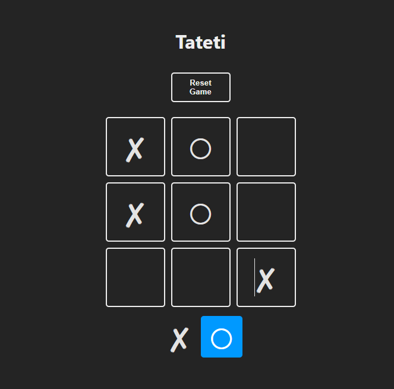
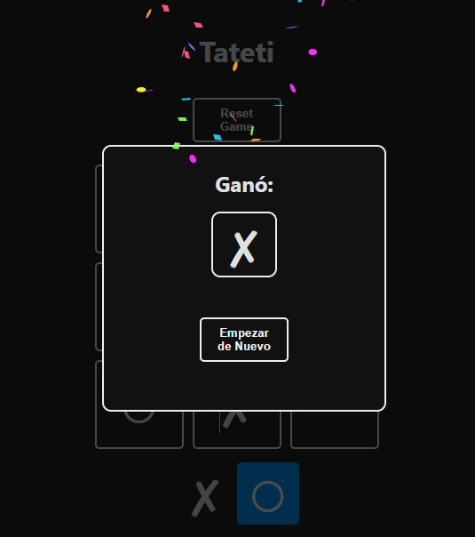

# Readme 📜

This is a Tic Tac Toe game , or Tateti , or 3 in line.

## Tecnologies applied ⚡

- React
- Vite
- JSX
- Javascript
- Bootstrap
- Html
- Css

## Requeriments ☕️

1- Clone this repo in your computer

```git
  git clone https://github.com/tomi-casabona/Sprint-4-TSC
```

2- Install and run typescript

```Bash
cd your-project-directory
npm run dev
```

## Features

- Click one square trying to get 3 equal figures in the same line.
- The game will be automatically saved for continuing playing after some time.
- You can restart a game with the button above.

## Images




